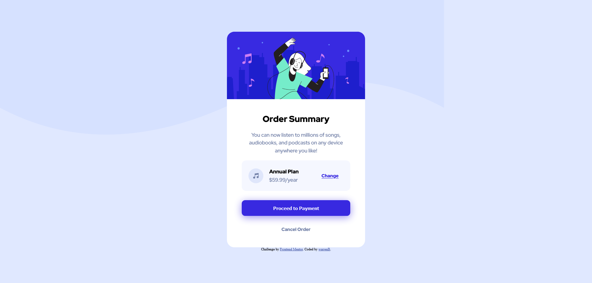

# Frontend Mentor - Order summary card solution

This is a solution to the [Order summary card challenge on Frontend Mentor](https://www.frontendmentor.io/challenges/order-summary-component-QlPmajDUj). Frontend Mentor challenges help you improve your coding skills by building realistic projects. 

## Table of contents

- [Overview](#overview)
  - [The challenge](#the-challenge)
  - [Screenshot](#screenshot)
  - [Links](#links)
- [My process](#my-process)
  - [Built with](#built-with)
  - [What I learned](#what-i-learned)
  - [Continued development](#continued-development)
  - [Useful resources](#useful-resources)
- [Author](#author)
- [Acknowledgments](#acknowledgments)

## Overview

### The challenge

Users should be able to:

- See hover states for interactive elements

### Screenshot




### Links

- Solution URL: [Git Hub](https://github.com/warrenbarney/order-summary-component-main)
- Live Site URL: [Netlify](https://shiny-faun-f729dd.netlify.app/ )

## My process

### Built with

- Semantic HTML5 markup
- CSS custom properties
- Flexbox
- CSS Grid


### What I learned

I learned a lot during this project.  I tried to implement some of the things I have learned about sizing em and rem values.  


```css
.block-2 {
  display: flex;
  align-items: center;
  margin: 1.5rem;
  width: 19rem;
  padding: 0.2em;
  border-radius: 0.75rem;
  background-color: $very_pale_blue;
  // border: 1px dotted blue;
}
```
### Continued development

I have found a passion and am excited about learning.  I am learning a lot from different places.  There is so much great infomation out there.  I am so glad to be a part of these communities for learning.

### Useful resources

- [box shadow](https://developer.mozilla.org/en-US/docs/Web/CSS/box-shadow) - I referenced this for shadows around the button element.
- [background-repeat](https://www.w3schools.com/css/css_background_repeat.asp) - I refenced this site for main background image.

## Author

- Git Hub - [warrenbarney](https://github.com/warrenbarney)
- Frontend Mentor - [@warrenbarney](https://www.frontendmentor.io/profile/warrenbarney)
- Twitter - [@warrenbarney73](https://twitter.com/WarrenBarney73)


## Acknowledgments

Thank you Frontend Mentor for all of this awesome practice.  
Thank you https://www.youtube.com/@KevinPowell your courses and videos have helped me a lot. 
